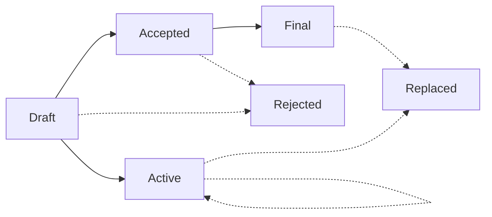

# AEP 1 : AEP Purpose and Guidelines

||ArmoniK Enhancement Proposal|
---:|:---
**AEP**| 1
**Title**| AEP Purpose and Guidelines  
**Author**| Dylan Brasseur <<dbrasseur@aneo.fr>>
**Status**| Draft
**Type**| Process

# What is a AEP ?

AEP stands for ArmoniK Enhancement Proposal. An AEP is a design document providing information to the ArmoniK community, or describing a new feature for ArmoniK or its processes or environment. The AEP should provide a concise technical specification of the feature and a rationale for the feature.

We intend AEPs to be the primary mechanisms for proposing major new features, for collecting community input on an issue, and for documenting the design decisions that have gone into ArmoniK. The AEP author is responsible for building consensus within the community and documenting dissenting opinions.

Because the AEPs are maintained as text files in a versioned repository, their revision history is the historical record of the feature proposal. This historical record is available by the normal git commands for retrieving older revisions, and can also be browsed [on GitHub](https://github.com/aneoconsulting/ArmoniK.Community).

# AEP Audience

The typical primary audience for AEPs are the ArmoniK Developer Team.

However, other parts of the ArmoniK community may also choose to use the process (particularly for Informational AEPs) to document expected API conventions and to manage complex design coordination problems that require collaboration across multiple projects. External contributors should also follow the guidelines established by the AEPs.

# AEP Types

There are three kinds of AEP:

1. A **Standard** AEP describes a new feature or implementation for ArmoniK.
2. An **Informational** AEP describes an ArmoniK design issue, or provides general guidelines or information to the ArmoniK community, but does not propose a new feature. Informational AEPs do not necessarily represent an ArmoniK community consensus or recommendation, so users and implementers are free to ignore Informational AEPs or follow their advice.
3. A **Process** AEP describes a process surrounding ArmoniK, or proposes a change to (or an event in) a process. Process AEPs are like Standard PEPs but apply to areas other than ArmoniK itself. They may propose an implementation, but not to ArmoniK’s codebase; they often require community consensus; unlike Informational AEPs, they are more than recommendations, and users are typically not free to ignore them. Examples include procedures, guidelines, changes to the decision-making process, and changes to the tools or environment used in ArmoniK development. Any meta-AEP is also considered a Process AEP.

# AEP Workflow

## ArmoniK Developer Team

In AEPs, the "ArmoniK Developer Team" refers to the team at [Aneo](https://www.aneo.eu/) in charge of deciding the core functionnalities and direction of ArmoniK. This term does not extend to ArmoniK external contributors. They decide whether a proposal should be considered as an AEP and they usually develop the feature in them.

## Submit an idea for ArmoniK

The AEP process begins with a new idea for ArmoniK. It is highly recommended that a single AEP contain a single key proposal or new idea; the more focused the AEP, the more successful it tends to be. Most enhancements and bug fixes don’t need an AEP and can be submitted directly to the [ArmoniK issue tracker](https://github.com/aneoconsulting/ArmoniK/issues). The ArmoniK Developer Team reserves the right to reject AEP proposals if they appear too unfocused or too broad.

To submit an idea for an AEP, open an issue on the [ArmoniK.Community issue tracker](https://github.com/aneoconsulting/ArmoniK.Community/issues) with the idea clearly presented. The discussion about the potential AEP is held in the issue with different propositions. After reaching a consensus with the community and at least part of the ArmoniK Developer Team, the idea can move to the next stage. An AEP number is assigned by the ArmoniK Developer Team. This step can be skipped by the ArmoniK Developer Team due to internal discussions.

## AEP State Diagram

An AEP can be in one of several states as decribed in this diagram :



Transitions are described in the workflow below.

## Creating the AEP

Once a consensus is reached and an AEP number assigned, the author forks the ArmoniK.Community and creates a aep-XXXXX.md file in the AEP directory, where XXXXX corresponds to the assigned AEP number. The author then writes the AEP following the guidelines and rules in AEP-00001 (the present document). The discussions in the issue must be taken into account and should be referenced in the AEP. A pull request is then created to merge the fork into the ArmoniK.Community repository.

The discussions regarding the AEP are continued in the pull request itself. Suggested changes to the AEP should include the potential modifications to the language used (grammar, sentence structure...), specifications clarifications or any relevant point missing or unclear that need to be precised. During this time, the AEP is in a Draft state.

The AEP can be directly created on the ArmoniK.Community repository on a separate branch if the author has write access to it.

## Accepting and Finalizing the AEP

Once the AEP has been reviewed and can be accepted, it is merged into the ArmoniK.Community repository with its state changed to Accepted. The initial issue receives a comment with a check list containing information on what needs to be done for the AEP to be considered Final. For an AEP to be accepted, it needs to be clear and complete, must represent a net improvement for ArmoniK and must meet the requirements and objectives asked for by the ArmoniK Developer Team.  
Once the check list items are implemented and merged, the AEP receives the Final state and the initial issue is closed as completed. When finalizing the AEP, links to relevant technical and/or user documentation can be added to the footnotes.

A Draft AEP can change to the Active state, meaning that it will never be Final. This can be the case for Informational and Process AEPs. They can be either ammended to take new information into account, or be replaced by a superseding AEP.

## AEP Rejection and Replacement

When in a Draft, Accepted state, an AEP can be rejected (or withdrawn) if, after further consideration, the AEP shouldn't be accepted because of design flaws, issues discovered during the implementation process or if the proposal was a bad idea after all. This rejection can either be mandated by the ArmoniK Developer Team, or be due to a withdrawal by the author of the AEP. In both cases, the AEP changes to a Rejected state. The initial issue will be closed as "not completed", but may be reopened if the idea is deemed of importance and relevance again.

If a subsequent AEP is made to supersede a Final or Active AEP, the superseded AEP changes to the Replaced state and its header must then contain the "Superseded-By" field.

# What constitutes an AEP ?

Each AEP should have the following parts/sections:

1. **Preamble** – Fields in a table format containing meta-data about the AEP, including the AEP number, a short descriptive title, the names, and optionally the contact info for each author, etc.

2. **Abstract** – a short (~200 word) description of the technical issue being addressed.

3. **Motivation** – The motivation is critical for AEPs that want to change ArmoniK's functionalities, ecosystem or processes. It should clearly explain why the existing specification is inadequate to address the problem that the AEP solves. This can include collecting documented support for the AEP from important projects using ArmoniK or belonging to the ArmoniK ecosystem. AEP submissions without sufficient motivation may be rejected.

4. **Rationale** – The rationale fleshes out the specification by describing why particular design decisions were made. It should describe alternate designs that were considered and related work, e.g. how the feature is supported in other softwares.  
The rationale should provide evidence of consensus within the community and discuss important objections or concerns raised during discussion.

5. **Specification** – The technical specification should describe the syntax and semantics of any new ArmoniK feature. The specification should be detailed enough to allow proper implementations for at least the current major languages used supported by ArmoniK.Api (C#, C++, Python).

6. **Backwards Compatibility** – All AEPs that introduce backwards incompatibilities must include a section describing these incompatibilities and their severity. The AEP must explain how the author proposes to deal with these incompatibilities. AEP submissions without a sufficient backwards compatibility treatise may be rejected outright.

7. **Security Implications** – If there are security concerns in relation to the AEP, those concerns should be explicitly written out to make sure reviewers of the AEP are aware of them.

8. **How to Teach This** – For an AEP that adds new functionality or changes ArmoniK's behavior, it is helpful to include a section on how to teach users, new and experienced, how to apply the AEP to their work.
This section may include key points and recommended documentation changes that would help users adopt a new feature or migrate their code to use an ArmoniK version change.

9. **Reference Implementation** – The reference implementation must be completed before any AEP is given status “Final”, but it need not be completed before the AEP is accepted. While there is merit to the approach of reaching consensus on the specification and rationale before writing code, the principle of “rough consensus and running code” is still useful when it comes to resolving many discussions of API details.
The final implementation must include test code and documentation appropriate for both the ArmoniK Developers and Users.

10. **Rejected Ideas** – Throughout the discussion of an AEP, various ideas will be proposed which are not accepted. Those rejected ideas should be recorded along with the reasoning as to why they were rejected. This both helps record the thought process behind the final version of the AEP as well as preventing people from bringing up the same rejected idea again in subsequent discussions.
In a way this section can be thought of as a breakout section of the Rationale section that is focused specifically on why certain ideas were not ultimately pursued.

11. **Open Issues** – While an AEP is in draft, ideas can come up which warrant further discussion. Those ideas should be recorded so people know that they are being thought about but do not have a concrete resolution. This helps make sure all issues required for the AEP to be ready for consideration are complete and reduces people duplicating prior discussion.

12. **Footnotes** – A collection of footnotes cited in the AEP, and a place to list non-inline hyperlink targets.

13. **Copyright/license** – Each new AEP must be placed under a dual license of public domain and CC0-1.0-Universal (see this AEP for an example).

# AEP Formats and Templates

AEPs are UTF-8 encoded text files using the [GitHub-flavored markdown](https://github.github.com/gfm/) format. Using undocumented Markdown syntax which "works" at one point with GitHub is discouraged, as it could break later without notice. Further specifications can be found in the [GitHub documentation](https://docs.github.com/en/get-started/writing-on-github).

# AEP Header Preamble

Each AEP must begin with a Markdown heading and table using the following format:

```markdown
# AEP {AEP number} : {AEP Title}

||ArmoniK Enhancement Proposal|
---:|:---
**AEP**| AEP number
**Title**| AEP Title
**Author**| Author name <<Author-email>>
**Status**| (Draft | Active | Accepted | Provisional | Deferred | Rejected | Withdrawn | Final | Superseded)
**Type**| (Standard | Informational | Process)
**Requires**| AEP numbers
**ArmoniK Version**| ArmoniK version
**Replaces**| AEP number
**Superseded-By**| AEP number
```

The "Requires", "ArmoniK Version", "Replaces" and "Superseded-By" fields can be ommitted for AEP where they're not relevant.
The Author field lists the names, and optionally the email addresses of all the authors/owners of the AEP. The format of the Author field values must be:

```markdown
Random J. User <<random@example.com>>
```

if the email address is included, and just:

```markdown
Random J. User
```

if the address is not given.

The Type field specifies the type of AEP: Standard, Informational, or Process.

Standard AEPs will typically have an ArmoniK Version field which indicates the version of ArmoniK that the feature will be released with. Informational and Process AEPs do not need an ArmoniK Version field.

AEPs may have a Requires header, indicating the AEP numbers that this AEP depends on.

AEPs may also have a Superseded-By header indicating that an AEP has been rendered obsolete by a later document; the value is the number of the AEP that replaces the current document. The newer AEP must have a Replaces header containing the number of the AEP that it rendered obsolete.

# Auxiliary Files

AEPs may include auxiliary files such as diagrams. All support files may be placed in a subdirectory called aep-XXXXX, where “XXXXX” is the AEP number.

# Changing Existing AEPs

Draft AEPs are freely open for discussion and proposed modification, at the discretion of the authors, until submitted to the ArmoniK Developper Team for review and resolution. Substantive content changes should generally be first proposed on the AEP’s Draft Pull Request, while copyedits and corrections can be submitted as subsequent GitHub pull request. AEP authors with write access to the AEP repository can update the AEPs themselves by using git push or a GitHub PR to submit their changes.

See the [Contributing Guide](https://aneoconsulting.github.io/ArmoniK.Community/) for additional details, and when in doubt, please check first with the AEP author and/or an ArmoniK.

# Copyright

This document is placed in the public domain or under the CC0-1.0-Universal license, whichever is more permissive.
