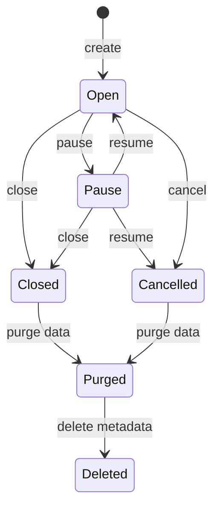

# AEP 3: Data lifecycle management inside sessions by ArmoniK

|                   |ArmoniK Enhancement Proposal|
---:                |:---
**AEP**             | 3
**Title**           | Data lifecycle management inside sessions by ArmoniK
**Author**          | Malak Elflitty <<melflitty@aneo.fr>>, Jérôme Gurhem <<jgurhem@aneo.fr>>
**Status**          | Draft
**Type**            | Standard
**Creation Date**   | 2023-09-22

# Abstract

This AEP proposes a new  API for sessions in ArmoniK, where we define the lifecycle of data inside a session and the lifecycle of a session.

# Motivation

Data used in ArmoniK is stored in object storage (Redis or Amazon S3), metadata are stored in a database(MongoDB). Deleting data from the object storage and the database as soon as it is not needed anymore allows to save resources, and eliminates the need to clean the object storage and the database periodically.

Data is directly related to the session it belongs to. Defining when to delete data is only one stage in its life. To define how this stage should be done, the full lifecycle of data inside a session should be clear. Since the decision on what to do with the data is tightly linked to the state of the session, it is crucial to describe also the lifecycle of a session.

# Rationale

What is done so far is to delete only payloads when they are consumed. The remaining types of data to delete are metadata, data dependencies, final and intermediary results.

A Time To Live configuration parameter is added for data in Redis, the default value is set to the maximum value which is very high but can be configured to a lower value. There is no parameter for TTL in Amazon S3 in ArmoniK.Core but it can be added in the configuration of Amazon S3 in the infrastructure of ArmoniK.

Deleting all the data at the right time is crucial for the effective usage of resources and to have more control over data for future goals.

# Specification

## Proposed lifecycle of a session

1. The session is created with the status Open. Results can be added to the session and tasks can be submitted to the session.
2. The session can be paused and resumed. When the session is paused, running tasks continue to run until completion but submitted tasks are removed from the queue and are not executed. Running tasks can still submit subtasks but they will not be inserted into the queue thus not being executed. When the session is resumed, tasks that can be submitted (dependencies resolved) are inserted into the queue. Tasks execution will resume.
3. In a session, tasks submission from the client and/or the worker can be disabled. In which, case errors will be produced during task submission.
4. Closing session will prevent task submission from client and tasks. Running tasks can finish and produce results but not submit new tasks.
5. A session can be cancelled. It will also cancel running tasks; these tasks will not run up to completion and will not be able to produce results.
6. Purge a session will trigger removing of data related to a session such as tasks payloads, data dependencies and outputs in the case where these data are still here. Tasks, Data and Sessions metadata will not be removed at this step for accounting purposes: we may need to take advantage from the metrics in the metadata so we may need to keep them for some additional time.
7. Delete a session remove all metadata related to session including Sessions, Tasks and Result metadata.

The following state diagram summarizes the worflow of a session.



Note: If we pause a session, submitted tasks are removed from the queue. If after a short time from when we paused the session, we resume it, removing submitted tasks from the queue may not be finished yet, and resuming the session will cause insert the submitted tasks(that were supposed to be removed from the queue) into the queue. The consequence of pausing/resuming a session in a short time is to have duplicated messages in the queue. This may have an important impact on the performance of the system. Accordingly, this should be done with precaution. Or maybe we should handle it in the implementation of resume, if possible.

## Proposed APIs

### Session services API

```protobuf
service SessionService {
  rpc ListSessions(ListSessionsRequest) returns (ListSessionsResponse);
  rpc GetSession(GetSessionRequest) returns (GetSessionResponse);
  rpc CancelSession(CancelSessionRequest) returns (CancelSessionResponse);
  rpc CreateSession(CreateSessionRequest) returns (CreateSessionReply);
  rpc PauseSession(PauseSessionRequest) returns (PauseSessionResponse);
  rpc ResumeSession(ResumeSessionRequest) returns (ResumeSessionResponse);
  rpc CloseSession(CloseSessionRequest) returns (CloseSessionResponse);
  rpc PurgeSession(PurgeSessionRequest) returns (PurgeSessionResponse);
  rpc DeleteSession(DeleteSessionRequest) returns (DeleteSessionResponse);
  rpc StopSubmission(StopSubmissionRequest) returns (StopSubmissionResponse);
}
```

The first three methods are already available in the current services API, with the difference that `CreateSessionReply` will be renamed to  `CreateSessionResponse`.

### Session messages API

The definition of the messages `CreateSessionRequest`  and `CreateSessionResponse` will not change.
Regarding the other methods of the first proposition of the services API, the request message need to have the session id, and the response message can be empty, since we have an error message that can tell if the method was successfully terminated. But, it is better to have a session summary in the response message with the status of the session updated.

Below is an example of the definition of `PauseSessionRequest`  and `PauseSessionResponse`.

```protobuf
message PauseSessionRequest {
  string session_id = 1; 
}
message PauseSessionRequest {
  SessionRawField session_field = 1; 
}
```

An example of an error message:

```protobuf
message CreateSessionError {
    string error_details = 1;
}
```

## About implementations

### How to delete data?

We can use Time To Live to delete data. When we want to delete data, we override the value of TTL. This value should be calculated from the time we changed it not from data creation date.We should be aware when changing the TTL of metadata inside the database, the value of TTL should be coherent with the parameter data retention period.

# Copyright

This document is placed in the public domain or under the CC0-1.0-Universal license, whichever is more permissive.
