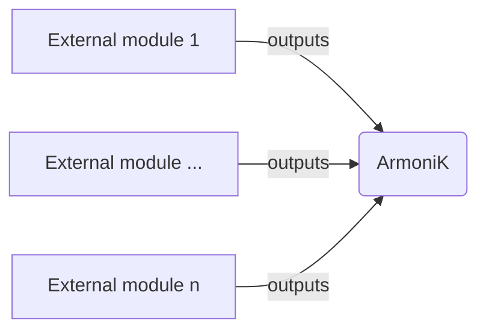

# AEP 5: ArmoniK Infrastructure redesign

|                   |ArmoniK Enhancement Proposal|
---:                |:---
**AEP**             | 5
**Title**           | ArmoniK Infrastructure redesign
**Author**          | Junior Dongo <<jdongo@aneo.fr>>, Florian Lemaitre <<flemaitre@aneo.fr>>
**Status**          | Draft
**Type**            | Standard
**Creation Date**   | 2024-03-04

# Abstract

This AEP describes the choices and gives a global view to redesigning ArmoniK's infrastructure.

# Motivation

The motivation behind redesigning the infrastructure is to have an infrastructure that is light, modular and easy to maintain. By standardizing the expected outputs for the various modules, switching from one technology vendor to another will be easier.

# Rationale

Updating or proposing alternative solutions for various components within the current infrastructure can be a challenging task.

# Specifications

First, we define the input variables that are expected from ArmoniK. These variables are essentially the outputs that are generated by the modules. We commonly refer to these variables as environment variables. Kubernetes defines three different approaches to populate these variables: using environment variable methods, configmaps, secrets, and volume mounts.

## Approach

Our approach is to have an infrastructure built on a modular basis.  We will first define all the modules ArmoniK needs.

We classify these modules into two categories: internal and external components. The internal components are a part of ArmoniK such as the compute plane, while the external components like MongoDB database are required for ArmoniK to function.

The internal components modules depend on external components either to function or to be created.

Modules outputs ---> ArmoniK



It is important to note that internal components require a specific format for the information they need. Therefore, it is essential to define and specify these requirements for every external module . As an example, the compute plane requires specific information from the activeMQ module to operate correctly. The necessary information from activeMQ is outlined below:

```tf
    "Components__QueueAdaptorSettings__ClassName"           = "ArmoniK.Core.Adapters.Amqp.QueueBuilder"
    "Components__QueueAdaptorSettings__AdapterAbsolutePath" = "/adapters/queue/amqp/ArmoniK.Core.Adapters.Amqp.dll"
    "Amqp__User"                                            = ""
    "Amqp__Password"                                        = ""
    "Amqp__Host"                                            = ""
    "Amqp__Port"                                            = ""
    "Amqp__Scheme"                                          = "AMQP"
    "Amqp__MaxPriority"                                     = ""
    "Amqp__MaxRetries"                                      = ""
    "Amqp__LinkCredit"                                      = ""

```

The internal module acts as a consumer of the various outputs from external modules.

## ArmoniK inputs (from storage module outputs)

```tf
variable "control_plane" {
  type = object({
    // ...
    conf = optional(list(object({
      env = optional(map(string), {})
      env_configmap = optional(set(string), [])
      env_from_configmap = optional(map(object({
        configmap = string
        field  = string
    })), {})
    })), [])
  })
}

variable "compute_plane" {
  type = object({
    // ...
    conf = optional(list(object({
      env = optional(map(string), {})
      env_configmap = optional(set(string), [])
      env_from_configmap = optional(map(object({
        configmap = string
        field  = string
    })), {})
    })), [])
  })
}

variable "polling_agent" {
  type = object({
    // ...
    conf = optional(list(object({
      env = optional(map(string), {})
      env_configmap = optional(set(string), [])
      env_from_configmap = optional(map(object({
        configmap = string
        field  = string
    })), {})
    })), [])
  })
}

variable "worker" {
  type = object({
    // ...
    conf = optional(list(object({
      env = optional(map(string), {})
      env_configmap = optional(set(string), [])
      env_from_configmap = optional(map(object({
        configmap = string
        field  = string
    })), {})
    })), [])
  })
}

variable "metric_exporter" {
  type = object({
    // ...
    conf = optional(list(object({
      env = optional(map(string), {})
      env_configmap = optional(set(string), [])
      env_from_configmap = optional(map(object({
        configmap = string
        field  = string
    })), {})
    })), [])
  })
}
```

Three components are part of the Armonik Core and are those consuming the outputs.

control-plane

compute-plane
- polling-agent
- worker

metrics-exporter

## Component outputs

The components output format should be the following:

```tf
# optional
output "env" {
  value = {
    VARIABLE_NAME = "value"
  }
}

# optional
output "env_configmap" {
  value = [
    "component-cm",
  ]
}

# env_secret like env_configmap

# optional
output "env_from_configmap" {
  value = {
    VARIABLE_NAME = {
      configmap = "component-cm"
      field = "field-within-cm"
    }
  }
}

# env_from_secret like env_from_configmap

# optional
output "mount_configmap" {
  value = {
    "mount-name" = {
      configmap = "component-cm"
      path = "/path/within/pod"
      subpath = "subpath/in/cm" # optional
      mode = "600" # optional
      items = { # optional
        "file" = {
           mode = "600" # optional
           field = "field-within-cm"
        }
      }
    }
  }
}

# mount_secret like mount_configmap

# optional
output "mount_volume" {
  value = ToBeDefined
}

# optional
output "mount_volume_claim" {
  value = ToBeDefined
}
```

## Modules passing to the ArmoniK module

```tf
module "armonik" {
  source = "path/to/armonik"

  control_plane = {
    ...
    conf = [ module.activemq, module.s3, module.mongodb ]
  }

  metrics_exporter = {
    ...
    conf = [ module.mongodb ]
  }

  ...
}
```

# Backwards Compatibility

This infrastructure redesign should be compatible with previous version of ArmoniK (Core, API, ...).

# How to Teach This

A document will be delivered on how to integrate a new module into the infrastructure so that it can be used.

# Copyright

This document is placed in the public domain or under the CC0-1.0-Universal license, whichever is more permissive.
