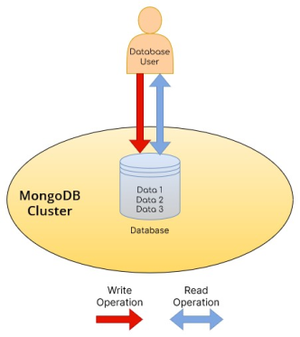
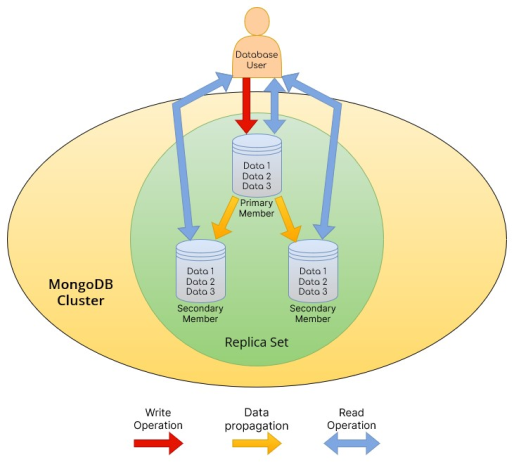
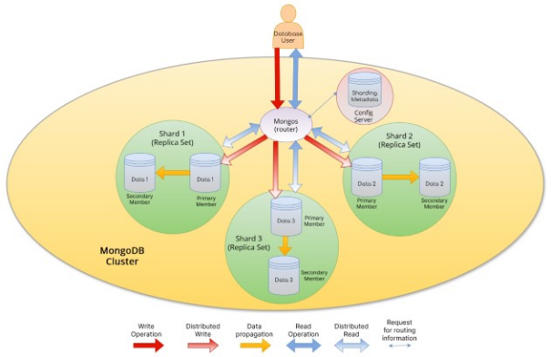

# AEP 6: Sharding and refactoring of MongoDB deployment inside

|                   | ArmoniK Enhancement Proposal                                  |
| ----------------: | :-------------------------------------------------------------|
|           **AEP** | 6                                                             |
|         **Title** | Sharding and refactoring of MongoDB deployment inside ArmoniK |
|        **Author** | Trystan Schneider <<tschneider@aneo.fr>>                      |
|        **Status** | Draft                                                         |
|          **Type** | Standard                                                      |
| **Creation Date** | 2024-06-26                                                    |

# Abstract

This AEP proposes a new deployment for the MongoDB database. The goal is to be able to shard (horizontal partitioning) MongoDB and deploy it with a Helm chart (the package manager for Kubernetes).

# Motivation

The motivation of this AEP is to proactively treat a potential bottleneck on the database.

Currently in ArmoniK, MongoDB is deployed using a simple replica set architecture, meaning that the database is composed of multiple identical instances. However, only one instance of the database supports write operations (the primary node), resulting in a potential bottleneck on this node. Additionnaly non-sharded database make read operations more costly, as the DB engine has to parse the whole database.

Finally, the current MongoDB module in our infrastructure's code is defined manually, which is not necessarily the best choice, deploying a database is a complex task, especially a sharded one.

# What is database sharding and how does it work ?

Sharding a database consists of splitting a database into several smaller independant parts. It is mostly used on distributed architectures to enhance the efficiency of database operations and allieviate tension on nodes.

## Sharding with MongoDB

MongoDB natively offers the possibility to set up a sharded database.

In MongoDB, the basics to implement the sharding are:

Firstly, we need to distinguish three main components in a sharded MongoDB infrastructure. Each of these components is actually an independant process and can have multiple instances in a sharded MongoDB cluster :

- The shards, which are the instances that contain the data (see [Shard documentation](https://www.mongodb.com/docs/manual/core/sharded-cluster-shards/))
- The routers (also called mongos), which are the instances that route database operations to the proper shard(s). They are serving as interface between the database clients and the shards. (see [Routers (mongos) documentation](https://www.mongodb.com/docs/manual/core/sharded-cluster-query-router/))
- The config servers, which store the sharded cluster's metadata: how data are distributed, as well as authentication information and RBAC settings. They also manage distributed locks. They are used by the routers to determine how to route queries.

All these components can be deployed through a MongoDB replicaset, thanks to the replication mechanisms provided by MongoDB.

To better envision how a sharded architecture changes from a replica set architecture, let's take a look at the schemas below.

## Simple standalone architecture

In a standalone architecture, only one MongoDB instance (mongod process) is available for all operations. The database user directly reaches directly that instance. If that instance somehow becomes unavailable data cannot be accessed.

## Single replica set architecture

A replica set is a set of several MongoDB instances (mongod processes) that contain the same data. A MongoDB instance that is part of a replica set is called a replica set member. In the schema above, the replica set has 3 members: one primary and two secondary. Only the primary member support write operations and are responsible to propagate data to the other members. Primary member also supports read operations. Secondary members support only read operations. A replica set cannot have more than one primary node.

What is interesting to see is that in a replica set architecture, the database user should define on which replica he/she wants to access.

If one or two members becomes unavailable, data are still accessible. But if the primary node becomes unavailable, it is not possible to perform write operations in the database.

## Sharded architecture

What we can see is that a sharded database consists of several replica sets each containing only parts of the data. These replica sets are agnostic of each other. Also, from the database user point of view a sharded database is transparent, as if it was communicating with a simple standalone (or replica set if the user wants to specify a read preferency) since the user only communicates with the router.

Hence, the real database is actually the concatenation of numerous and independant logical databases (three in our example) in the MongoDB cluster. The router instance is reponsible for the concatenation work needed when the user requests several documents located on multiple shards.

The router is also able to perform read preferences when querrying a specific shard. For readability concerns, the arrows representing distributed read operations point at the replica sets but keep in mind that the router is able to query all the members of a shard individually.

In a sharded cluster, the mongos instances are similar to the role of the database user presented in the previous architectures.

Note that the config server is also deployed as a replica set. It is not clear in the schema above because we didn't want to overload it with too much information, as we are focusing on sharding user-intended database.

It is important to notice that multiple mongos routers can also be deployed in the cluster but there are no need for replica set as they are stateless.

# Rationale

Sharding the database would alleviate the tension on all the nodes. For the primary nodes, the write operations would be distributed among other shards' primary node, and for the secondary nodes there can be some situations where only the right shard is queried (it will be explicited below in this AEP) and as mentionned above, the read operations are faster on a sharded cluster since the data is distributed among multiple instances.

This sharded (or not) MongoDB deployment would be defined in an example of our infrastructure code as a Helm release resource (called by Terraform). A Helm release is an instance of a Helm chart. Helm charts are templates that allow to deploy resources within a Kubernetes cluster in configurable way.
Using Helm charts delegates the complexity of defining a deployment towards the authors of a Helm chart, in accordance with the "Don't reinvent the wheel" principle.

Instead of manually defining all the Kubernetes resources and their configuration for a MongoDB deployment within Terraform modules as it is currently done with ArmoniK's example infrastructure, Helm charts allow us to focus only on passing the desired configuration for our MongoDB deployment. Nevertheless, it is possible that some Kubernetes resources or bash scripts will still be needed inside Terraform for specific configuration purposes. Helm charts also offer that capacity.

Some other alternatives to answer this problematic were considered :

- Adding some resources and modifying some others in our Terraform module. To respect good practices (KISS and "don't reinvent the wheel" principles), we found this solution unrelevant as others developers are able to provide us out-of-the-box MongoDB deployments, which is often a better way of building softwares as the complexity is shifted to the Helm chart definiton.
- Using Kubernetes operator for MongoDB. Unfortunately, no operator supporting sharding have been found.

To conclude, using a MongoDB Helm chart would allow ArmoniK to benefit from an out-of-the-box MongoDB deployment to separate the complexity of it from the sheer infrastructure code defined in Terraform, as well as benefit from the maintenance of the Helm chart provided by the MongoDB community itself.

# Specification

## Overview

Until now ArmoniK's table storage was described with multiple Kubernetes resources and bash scripts. Using Helm charts for table storage will reduce the maintenance and improve the reusability of our example infrastructure by other organisations.

In the example infrastructure, [Bitnami's Helm chart](https://artifacthub.io/packages/helm/bitnami/mongodb-sharded) for MongoDB (sharded or not) will be used.

Here is what the Helm chart would handle indepedently with the chart used (sharded or not) :

- The creation of the Kubernetes resources needed to deploy MongoDB, including the persistent volumes and the underlying logic to use them (see [PersistentVolumeClaims documentation](https://kubernetes.io/docs/concepts/storage/persistent-volumes/#persistentvolumeclaims))
- MongoDB initialization and launching

## WARNING

As the developments and tests supporting this AEP were done using Bitnami's Helm charts and images for MongoDB, the following specifications apply to these charts and images and it is absolutely not guaranted that they are valid with other charts or images.

As Bitnami's images are not verified with Docker Scout, we advice to adapt Bitnami's mongodb-sharded image to make it compliant with your personnal or business security requirements.

As quick-deploy is an example of ArmoniK deployment meant to help understanding what ArmoniK needs to run correctly, we are not responsible for warrantying a full operationality in production environment, especially in a security-compliant point of view.

## Technical Specifications

**The principal modifications will be**:

- The possibility to choose whether to deploy MongoDB sharded or not.
- The data pods would be deployed within a StatefulSet object in Kubernetes, which is more suited for stateful applications (for more information, check the [StatefulSet documentation](https://kubernetes.io/docs/concepts/workloads/controllers/statefulset/)).
- Since Helm takes over the whole MongoDB initialization, the _configmap.tf_ file inside the MongoDB module, which defines the local file resources containing the initialization scripts, would be removed.
- The possibility to configure the Helm charts used to deploy MongoDB, although it is adviced to use the default ones.
- TLS certificates would no longer be manually created inside the Terraform module.
- The capacity to configure a timeout proportional to the number of MongoDB instances to be deployed on infrastructure setup. Since deploying a replicated or sharded MongoDB deployement can take quite some time, it is an important parameter to consider, as the default 5 minutes timeout for deploying a MongoDB can be easily exceeded. The default value is 4 minutes per instance (replica or shard times replica for a sharded deployment )

**What would be specific to the classic unsharded MongoDB Helm chart ?**

- It would be possible to deploy an out-of-the-box MongoDB instance, whether with a replica set architecture, or with a simple standalone architecture, eventhough it is highly unrecommended in most cases.
- The deployment would be exposed with a headless Kubernetes service, which is more suited for stateful applications that don't require load-balancing, as it allows to reach the pods directly as they have a persistent and identifying DNS record within the Kubernetes cluster (see [headless services documentation](https://kubernetes.io/docs/concepts/services-networking/service/#headless-services) in Kubernetes).

**What would be specific to the sharded MongoDB Helm chart ?**

- It would be possible to deploy an out-of-the-box sharded MongoDB instance, with a configurable, but rather static, number of shards. We are currently working on a way to implement autoscaling. The number of config servers replicas and mongos "replicas" would also be configurable.
- TLS still has to be managed.
- The _database_ namespace in MongoDB as well as non-root MongoDB users are created via a custom initialization script.
- ArmoniK Core would authenticate as MongoDB administrator as sharding a MongoDB collection requires an admin role (see [MongoDB documentation](https://www.mongodb.com/docs/manual/reference/command/shardCollection/#mongodb-dbcommand-dbcmd.shardCollection)).

## Inside Kubernetes

In our case, since the MongoDB cluster is deployed within a Kubernetes cluster thanks to a Helm chart, we need to describe the Kubernetes objects defined by Bitnami's chart to manage the different components of the MongoDB cluster.

Bitnami's mongodb-sharded Helm chart offers an out-of-the box infrastructure setup needed to host a sharded MongoDB instance and mainly creates the following Kubernetes objects :

- For the shards, each of them is deployed through a StatefulSet. Each StatefulSet contains the replicas associated with each shard. For example, if you want to deploy 3 shards, each containing two [replica set] members, you would have in Kubernetes, 3 StatefulSet's : `shard-0, shard-1, shard-2` each of them containing 2 pods, `data-0` and `data-1` which makes up for a total of 6 pods in the Kubernetes cluster for the shards.
- The config servers are also deployed through a unique StatefulSet managing all the config servers.
- The routers are deployed through a unique Deployment, since they are stateless proccesses, managing all the mongos instances.

Finally, two Services are created :

- A headless Service, which is used for the internal functionning of the sharded cluster in Kubernetes. For example, to perform a write operation, the routers need to know how to access to a particular shard pod. (for more information on headless Services, see the [Kubernetes documentation](https://kubernetes.io/docs/concepts/services-networking/service/#headless-services))
- A "classical" Service, which is used by MongoDB clients to access a mongos instance.

### Shard the collections

ArmoniK's Core would take over collection sharding. A new environment variable for Core would indicate whether to perform sharding on the database. If so, the collections to be sharded would be TaskData, SessionData and Result.

That being said, sharding a collection is not as trivial as it could seem. We need to talk a bit about shard keys and their choice.

### Shard Keys

Shard keys are basically indexes (simple or compounded) that will be used to determine the way data are distributed among the shards.

Defining a relevant shard key is crucial when sharding a database. A bad shard key could result in a bottleneck and even worsen the efficiency of your database. For more information on how to choose a shard key check the [Choose a Shard Key documentation](https://www.mongodb.com/docs/manual/core/sharding-choose-a-shard-key/). The shard key choice falls to the database administrator.

MongoDB proposes two types of shard keys :

- Hashed keys, which are better to evenly distribute data among shards but increase the read operations for multiple-documents read operations, as they likely distribute documents with close shard key value on different shards. (see [Hashed Sharding documentation](https://www.mongodb.com/docs/manual/core/hashed-sharding/))
- Range keys, which are not ideal for evenly distribute data among shards but more adapted for multiple-documents read operations. (see [Ranged Sharding documentation](https://www.mongodb.com/docs/manual/core/ranged-sharding/))

For now, ArmoniK would use the default MongoDB id attribut (`_id`) as a hashed shard key, since the point of this database upgrade is to enhance orchestration's performance.

Linked to [AEP4](https://github.com/aneoconsulting/ArmoniK.Community/blob/main/AEP/aep-00004.md), the capacity to performe [zone sharding](https://www.mongodb.com/docs/manual/core/zone-sharding/) is being studied.

### References

For more information on how sharding works in MongoDB, check out their [official sharding documentation](https://www.mongodb.com/docs/manual/sharding/)

# Backwards Compatibility

## With ArmoniK Infrastructure (IMPORTANT)

Currently, the main concern on backwards incompatibility is about data persistency in MongoDB, as we haven't focused on the possibility to pass down custom persistent volumes to the Helm release resource.

Which means that if your database contains data, if you want to upgrade the infrastructure version to deploy MongoDB (sharded or not doesn't matter) with a Helm chart, one of these two situations will arise :

- If you are using Persistent Volumes with a reclaim policy set to "Retain", you will be able to keep your data but unable to automatically provide it to the new MongoDB pods freshly created by the Helm release.
- Your data will be lost if you are using Persistent Volumes with a reclaim policy set to "Delete", which is the default value with dynamic provisioning.

## With ArmoniK

This refactoring would not be backward-compatible with previous versions of ArmoniK since we would prefer to not set default values for the Helm chart version. Which means that calls to this refactored MongoDB module must define the `helm_chart_version` parameter, which is not implemented in previous versions of ArmoniK.

## With ArmoniK Core

This refactoring would be backward-compatible with previous versions of ArmoniK Core but would not be optimal in case of a sharded MongoDB instance, since these previous versions do not implement the database commands to enable sharding.

# Security Implications

The unsharded Bitnami's MongoDB Helm chart does not generate TLS certificate for clients. The sharded one does not seem to support TLS at all. Keep in mind that our deployment is still an example and could/should be different in a production environment to match with the security policies of each company.

Additionnaly, the sharded chart currently doesn't provide a mechanism to create non-root users but workarounds are possible

# Open Issues

- Providing custom persistent volumes to the MongoDB Helm release deployed.
- Full support of TLS for both charts.

# Copyright/license

This document is placed in the public domain or under the CC0-1.0-Universal license, whichever is more permissive.
