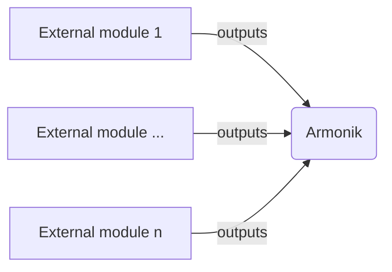

# AEP X: ArmoniK Infrastructure redesign

|                   |ArmoniK Enhancement Proposal|
---:                |:---
**AEP**             | 
**Title**           | ArmoniK Infrastructure redesign
**Author**          | 
**Status**          | Draft
**Type**            | Standard
**Creation Date**   | 2024-03-04


# Abstract

This AEP describes the choice and give a global view to redesign ArmoniK's infrastructure.

# Motivation

The motivation behind the redesign of the infrastructure is to have an infrastructure that is light, modular and easy to maintain. By standardizing the expected outputs for the various modules, the switch between one technology vendor to another one will be made easy.


# Rationale

Updating or proposing alternatives solution for various component with the current infrastructure is challenging at time. 

# Specifications

First, we define the input variables that are expected from Armonik. This is the output provided by the modules. These variables are referred to as environment variables. Kubernetes defines three ways to populate these variables: using environment variable methods, config maps, secret, and mount from environment.

## Approach

Our approach is to have an infrastructure built on a modular basis.  We will first define all the modules needed by Armonik. 
We distinguish the components Armonik needs to work (for example a mongoDB database) lets call them external and the components that are part of ArmoniK (such as compute plane) internal. 

The internal components modules depend on external components ones to work or to be built.


Modules outputs ---> ArmoniK 



It is important to note that internal components require a specific format for the information they need. Therefore, it is essential to define and specify these requirements for each external module. As an example, the compute plane requires information from the activeMQ module, as outlined below:

```tf
    "Components__QueueAdaptorSettings__ClassName"           = "ArmoniK.Core.Adapters.Amqp.QueueBuilder"
    "Components__QueueAdaptorSettings__AdapterAbsolutePath" = "/adapters/queue/amqp/ArmoniK.Core.Adapters.Amqp.dll"
    "Amqp__User"                                            = ""
    "Amqp__Password"                                        = ""
    "Amqp__Host"                                            = ""
    "Amqp__Port"                                            = ""
    "Amqp__Scheme"                                          = "AMQP"
    "Amqp__MaxPriority"                                     = ""
    "Amqp__MaxRetries"                                      = ""
    "Amqp__LinkCredit"                                      = ""

```
The internal module will then acts as a consumer of the various outputs from external modules. 

## ArmoniK inputs (from storage module outputs)

```tf
variable "control_plane" {
  type = object({
    // ...
    conf = optional(list(object({
      env = optional(map(string), {})
      env_configmap = optional(set(string), [])
      env_from_configmap = optional(map(object({
        configmap = string
        field  = string
    })), {})
    })), [])
  })
}
variable "control_plane_env" {
    description = "Environment variables to pass to the control plane"
    type        = map(string)
    default     = {}
    // Example:
    // {
    //   "Components__QueueAdaptorSettings__AdapterAbsolutePath" = "/adapters/queue/amqp/ArmoniK.Core.Adapters.Amqp.dll"
    // }
}


variable "control_plane_env_cm" {
    description = "Environment variables from existing config map to pass to the control plane"
    type        = set(string)
    default     = []
    // Example:
    // [
    //   "amqp-cm"
    // ]
    // 
    // amqp-cm:
    //   Amqp__MaxRetries: 5
    //   Amqp__LinkCredit: 2
}

variable "control_plane_env_secret" {
    description = "Environment variables from existing secret to pass to the control plane"
    type        = set(string)
    default     = []
    // Example:
    // [
    //   "amqp-secret"
    // ]
    // 
    // amqp-secret:
    //   Amqp__Host: amqp.svc
    //   Amqp__Scheme: AMQPS
    //   Amqp__AllowHostMismatch: true
}

variable "control_plane_env_from_secret" {
    description = "Environment variables from existing secret to pass to the control plane"
    type        = map(object({
        secret = string
        field  = string
    }))
    default = {}
    // Example:
    // {
    //   "Amqp__User" = {
    //     secret = "amqp-credentials"
    //     field  = "user"
    //   },
    //   "Amqp__Password" = {
    //     secret = "amqp-credentials"
    //     field  = "password"
    //   }
    // }
    //
    // amqp-credentials:
    //   user: dG90bw==
    //   password: dG90bw==
}

variable "control_plane_mount_cm" {
    description = "Volume mount from ConfigMap to pass to the control plane"
    type        = map(object({
        configmap = string
        path      = string
        subpath   = optional(string)
        mode      = optional(string, "644")
        items = optional(map(object({
            mode  = optional(string, "644")
            field = string
        })), {})
    }))
    default = {}
}

variable "control_plane_mount_secret" {
    description = "Volume mount from Secret to pass to the control plane"
    type        = map(object({
        secret  = string
        path    = string
        subpath = optional(string)
        mode    = optional(string, "644")
        items = optional(map(object({
            mode  = optional(string, "644")
            field = string
        })), {})
    }))
    default = {}
    // Example:
    // {
    //   "amqp-certificates" = {
    //     secret  = "amqp-certs"
    //     path    = "/amqp"
    //     subpath = null
    //     mode    = "600"
    //     items = {
    //       "amqp.pem" = {
    //          mode  = "600"
    //          field = "ca.crt"
    //       }
    //     }
    //   }
    // }
    // 
    // amqp-certificates:
    //   ca.crt: BASE64==
    //
    // /amqp
    // └── amqp.pem
}


variable "control_plane_mount_volume" {
    type = ToBeDefined
}
variable "control_plane_mount_volume_claim" {
    type = ToBeDefined
}
```


Three components are part of the Armonik Core and are those consuming the outputs. 

control-plane

compute-plane
- polling-agent
- worker

metrics-exporter

## Component outputs

Component outputs will be something like that:

```tf
# optional
output "env" {
  value = {
    VARIABLE_NAME = "value"
  }
}

# optional
output "env_configmap" {
  value = [
    "component-cm",
  ]
}

# env_secret like env_configmap

# optional
output "env_from_configmap" {
  value = {
    VARIABLE_NAME = {
      configmap = "component-cm"
      field = "field-within-cm"
    }
  }
}

# env_from_secret like env_from_configmap

# optional
output "mount_configmap" {
  value = {
    "mount-name" = {
      configmap = "component-cm"
      path = "/path/within/pod"
      subpath = "subpath/in/cm" # optional
      mode = "600" # optional
      items = { # optional
        "file" = {
           mode = "600" # optional
           field = "field-within-cm"
        }
      }
    }
  }
}

# mount_secret like mount_configmap

# optional
output "mount_volume" {
  value = ToBeDefined
}

# optional
output "mount_volume_claim" {
  value = ToBeDefined
}
```

## Modules passing to the ArmoniK module


```tf
module "armonik" {
  source = "path/to/armonik"

  control_plane = {
    ...
    conf = [ module.activemq, module.s3, module.mongodb ]
  }

  metrics_exporter = {
    ...
    conf = [ module.mongodb ]
  }

  ...
}
```
# Backwards Compatibility

This infrastrure redesign should be compatible with previous version of ArmoniK (Core, API, ...).

# How to Teach This

A document will be deliver on how to integrate a new module in the infrastructure so that it can be used. 


# Copyright

This document is placed in the public domain or under the CC0-1.0-Universal license, whichever is more permissive.